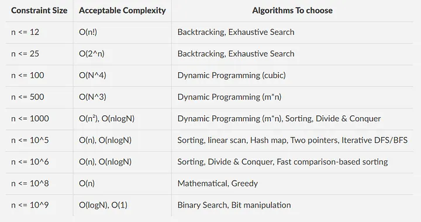

# Competitive Programming Reference Guide

## Time Complexity

- `n < 20`: consider exhaustive strategies such as `2^n` brute force or `n!` backtracking. Keep pruning aggressively.
- `n < 3000`: quadratic `O(n^2)` dynamic-programming solutions are usually safe.
- `3000 < n < 10^6`: aim for `O(n)` or `O(n log n)` via two pointers, greedy, heaps, divide and conquer, or sorting tricks.
- `n > 10^6`: target `O(log n)` or `O(1)` using binary search, arithmetic formulas, or bit hacks; even linear scans become expensive.
The answer to this question is directly related to the number of operations that are allowed to perform within a second. Most of the sites these days allow 10⁸ or 10⁷ operations per second. After figuring out the number of operations that can be performed, search for the right complexity by looking at the constraints given in the problem.




## Sliding Window

- Use on linear data structures (arrays, strings, linked lists).
- Maintain a moving subarray/substring while checking constraints (length, sum, distinctness, frequency).
- Replace nested loops with incremental updates to drop complexity from `O(n^2)` to `O(n)`.
- Combine with hash maps or frequency arrays for character and count tracking.

## Two Pointers

- Operate on sorted or partially ordered arrays/lists/strings.
- Move left/right pointers to find pairs, triplets, or bounded ranges.
- Ideal for deduplication, partitioning, and shrinking/expanding windows.
- Supports in-place filtering (e.g., remove duplicates, move zeros).

## Slow and Fast Pointer

- Use two pointers with different speeds on linear structures.
- Detect cycles (Floyd's tortoise and hare), find middle nodes, or discover cycle entry points.
- Maintain `O(1)` extra space and keep traversal to one pass.

## Linked List Reversal

- Reverse a linked list entirely in one pass with constant space.
- Reverse sublists between indices `m` and `n` without additional data structures.
- Reverse nodes in groups of `k` for chunked reordering.

## Binary Search

- Needs a monotonic condition or sorted input (arrays, answers, time).
- Locate elements, insertion indices, or left/right boundaries.
- Handle duplicates carefully (lower/upper bound variants).
- Apply to rotated arrays, sqrt calculations, and binary search on the answer space.

## Top K Elements

- Retrieve the smallest/largest `k` elements via heaps, partial sorting, or quickselect.
- Maintain running top-k in streaming scenarios using bounded heaps.
- Solve frequency-based problems (top-k frequent elements, k most common words).

## Binary Tree Traversal

- Preorder (root -> left -> right): useful for serialization/deserialization.
- Inorder (left -> root -> right): yields sorted results in BSTs, supports kth-smallest queries.
- Postorder (left -> right -> root): compute aggregated metrics (height, subtree sums).
- Level order (BFS): processes nodes layer by layer; ideal for breadth-first properties.

## Graph and Matrix

- Treat grids as graphs with 4/8-directional adjacency.
- DFS explores depth-first paths; use for connected components, flood fill, backtracking.
- BFS finds shortest paths in unweighted graphs and performs multi-source propagation.
- Topological sort orders tasks with dependencies and detects DAG validity.

## Backtracking

- Enumerate combinations, permutations, subsets, and partitions.
- Solve constraint satisfaction problems (Sudoku, N-Queens, crossword fill).
- Use pruning (bounds, feasibility checks, visited sets) to cut branches early.

## DP

- Presence of overlapping subproblems and optimal substructure signals DP.
- Shines in optimization (min/max cost), counting, and sequence analysis (LIS, LCS, edit distance).
- Either memoize recursive solutions or build bottom-up tables.
- Converts exponential brute-force into polynomial-time solutions.

## Bit Manipulation

- Count set bits, isolate least-significant set bit, or test powers of two.
- Perform arithmetic using bit operators (simulate addition without `+`/`-`).
- Use XOR for duplicate cancellation and subset enumeration via bit masks.
- Combine with DP/state compression to encode sets or visited masks.

## Overlapping Intervals

- Sort intervals by start time; merge overlaps or find disjoint gaps.
- Detect schedule conflicts (meeting rooms) with sweepline scans and min-heaps.
- Compute intersection/union coverage and identify missing ranges.

## Monotonic Stack

- Maintain next greater/smaller elements in linear time.
- Identify span/width in histograms, stock span, daily temperatures.
- Use monotonic queues for sliding-window maxima/minima.

## Prefix Sum

- Precompute cumulative sums to answer range queries quickly.
- Extend to difference arrays, 2D prefix sums, and imos method for range updates.
- Combine with hash maps to count subarrays meeting a target sum.

## Substring vs Subsequence

- Subarrays/substrings are contiguous segments.
- Subsequences retain order but can skip elements.

## Time Complexity

- Plain recursion often costs `O(2^n)`; memoization/tabulation can reduce it drastically.
- Tail recursion optimizes stack usage but may still need conversion in languages without TCO.

## Topics

### Catalan Number

Catalan numbers form a sequence that counts numerous combinatorial structures.

- Closed form: `C_n = (1/(n + 1)) * binom(2n, n) = (2n)! / (n! * (n + 1)!)`.
- DP recurrence: `C_0 = 1`, `C_n = sum_{i=0}^{n-1} C_i * C_{n-1-i}`.
- Applications:
  - Count well-formed parentheses strings (for `n = 3`: `((()))`, `()(())`, `()()()`, `(())()`, `(()())`).
  - Count unique BST structures with `n` keys.
  - Count full binary trees with `n + 1` leaves.
  - Count non-crossing chord pairings on a circle with `2n` points.

### Binary

Useful utility snippets:

- Test kth bit: `(num & (1 << k)) != 0`.
- Set kth bit: `num |= (1 << k)`.
- Unset kth bit: `num &= ~(1 << k)`.
- Toggle kth bit: `num ^= (1 << k)`.
- Power of two check: `(num & (num - 1)) == 0` or `(num & -num) == num`.
- Swap without temp: `a ^= b; b ^= a; a ^= b`.
- Compare floating values with tolerance: `abs(x - y) <= 1e-7`.

### String

- Normalize input (case, whitespace) before comparisons if necessary.
- Two-pointer or sliding-window methods handle most substring problems.
- Use hash maps or arrays for frequency tracking, and tries for prefix problems.

### Non-repeating Characters

Use a 26-bit mask to encode lowercase letters present in a string:

```python
mask = 0
for c in set(word):
    mask |= 1 << (ord(c) - ord("a"))
```

Two strings share common characters if `mask_a & mask_b > 0`.

### Anagram

An anagram rearranges all characters of a word or phrase. Interview variants usually ignore spaces and case.

- Sort both strings and compare (`O(n log n)` time).
- Map characters to primes and multiply products (be cautious of overflow).
- Count letter frequencies with arrays or hash maps for `O(n)` time, `O(1)` space.

### Palindrome

A palindrome reads identically forwards and backwards (e.g., `madam`, `racecar`, `1221`).

- Two pointers meet in the middle to validate in `O(n)` time.
- Clean strings (lowercase, alphanumeric only) when required.
- Reminder: BFS uses a queue, DFS uses a stack — handy when checking palindromic structures in graphs/trees.

### LinkedList

- Quick sort suits arrays; merge sort fits linked lists due to effortless splitting/merging.
- Practice reversing, merging sorted lists, detecting cycles, and swapping pairs — common interview staples.

### Tree

A tree is an undirected, connected, acyclic graph.

- Binary tree level `d` contains at most `2^d` nodes.
- A full binary tree of height `h` has `2^(h + 1) - 1` nodes.
- Number of levels in a tree equals height + 1 (with root at level 1).

### BST

- Inorder traversal yields ascending values.
- Reverse inorder (right → root → left) yields descending values.
- Exploit BST properties for predecessor/successor queries and range searches.

### Graph

- Dijkstra: shortest path from a source in non-negative weighted graphs.
- Bellman-Ford: handles negative edges and detects negative cycles.
- Floyd-Warshall: all-pairs shortest paths, supports negative edges (but not negative cycles).

### Heap

- For 0-indexed heap: `left = 2*i + 1`, `right = 2*i + 2`, `parent = (i - 1) // 2`.
- Maximum nodes in a heap of height `h`: `2^(h + 1) - 1`.
- Supports priority scheduling, median tracking, and top-k queries.

### Some common formulas

- Sum `1..n`: `(n + 1) * n / 2`.
- Geometric sum `2^0 + 2^1 + ... + 2^n = 2^(n + 1) - 1`.
- Permutations `P(n, k) = n! / (n - k)!`.
- Combinations `C(n, k) = n! / (k! * (n - k)!)`.

### 📋 Table of Patterns

| 🧩 Pattern                        | 💡 Real-Life Analogy                              | 🧠 Solves                                                   |
| --------------------------------- | ------------------------------------------------- | ----------------------------------------------------------- |
| **Sliding Window**                | "Peeking through a moving window"                 | Longest Substring, Max Sum Subarray, Anagrams               |
| **Two Pointers**                  | "Two fingers walking toward each other"           | 2Sum, Reverse Vowels, Sorted Squares, Palindrome Check      |
| **Fast & Slow Pointers**          | "Tom & Jerry: one fast, one slow 🐭🐱"            | Linked List Cycle, Happy Number                             |
| **Binary Search**                 | "Guess the number in 7 tries or less"             | Rotated Array, First/Last Position, Koko Eating Bananas     |
| **DFS / BFS**                     | "DFS: go deep. BFS: go wide."                     | Graph Traversals, Flood Fill, Word Ladder, Shortest Path    |
| **Backtracking**                  | "Trying all outfits before choosing one 👗"       | Sudoku, N-Queens, Word Search, Permutations                 |
| **Dynamic Programming (DP)**      | "Why re-solve what you've already solved?"        | Knapsack, House Robber, LIS, Edit Distance                  |
| **Greedy**                        | "Always pick what seems best right now"           | Activity Selection, Jump Game, Gas Station                  |
| **Union-Find (DSU)**              | "Friend circles detection 👯‍♀️"                     | Number of Provinces, Kruskal's MST, Connected Components    |
| **Topological Sort**              | "Finish A before B 📦"                            | Course Schedule, Task Scheduling                            |
| **Prefix Sum / Difference Array** | "Running totals like bank statements 💸"          | Range Sum, Subarray Sum Equals K, Rainwater Trapping        |
| **Monotonic Stack / Queue**       | "Stacking plates or tallest first 📏"             | Next Greater Element, Daily Temperatures, Largest Rectangle |
| **Bit Manipulation**              | "Flip switches to solve puzzles 💡"               | Single Number, Count Bits, Subsets, XOR Problems            |
| **Trie (Prefix Tree)**            | "Autocomplete dictionary 📚"                      | Word Search, StartsWith, Replace Words                      |
| **Heap / Priority Queue**         | "Serve most urgent first ⏳"                      | Kth Largest, Top K Elements, Merge K Lists                  |
| **Graph (Adjacency List/Matrix)** | "Follow paths on a map 🗺️"                        | Shortest Path, Cycles, Connected Components                 |
| **Recursion**                     | "Function calling itself – like Russian dolls 🪆" | Tree Problems, Factorial, Subsets, Merge Sort               |
| **Segment Tree / Fenwick Tree**   | "Smart range queries 📊"                          | Range Sum/Min/Max, Point & Range Updates                    |
| **Matrix Traversal**              | "Walk in all directions 🧭"                       | Spiral Order, Island Count, Diagonal Traversals             |
| **HashMap**                       | "Lookup table memory 📒"                          | 2Sum, Group Anagrams, Frequency Counts                      |

---

# Python Competitive Programming Playbook

Python-first notes to move quickly in contests and interviews. The code in this repository is organised by technique (stack, queue, DP, graph, etc.); the cheat sheet below maps the most useful patterns to those folders.

## Quick-start template

```python
#!/usr/bin/env python3
import sys
from math import gcd, sqrt, ceil, floor
from collections import defaultdict, Counter, deque
from heapq import heappush, heappop, heapify
from bisect import bisect_left, bisect_right

input = sys.stdin.readline  # fast I/O

def ints():
    return map(int, input().split())

def solve():
    # your logic here
    pass

if __name__ == "__main__":
    t = 1
    # t = int(input())
    for _ in range(t):
        solve()
```

### C++ -> Python muscle memory
- `vector<int>` -> `list[int]`
- `unordered_map` -> `dict`
- `priority_queue<int>` -> `heapq` (min-heap; negate for max-heap)
- `deque` -> `collections.deque`
- `lower_bound`/`upper_bound` -> `bisect_left`/`bisect_right`
- `cin / cout` -> `sys.stdin.readline` / `sys.stdout.write`

## Python KPIs & Cheatsheet

- **Stacks**
  - Lightweight: `list.append`, `list.pop()` -> both O(1).
  - Queue-to-stack trick: rotate `deque` after each push to keep the newest element at the front.
  - Max stack: maintain `(value, running_max)` pairs for O(1) max queries.

- **Queues / Deques**
  - Use `collections.deque` for O(1) `append`, `appendleft`, `popleft`.
  - Queue via two stacks gives amortized O(1) even without `deque`.
  - Sliding window tip: store indices to drop expired elements quickly.

- **Priority Queues (Heaps)**
  - `heapq` is min-heap; negate keys for max-heap behaviour.
  - Keep `(priority, payload)` tuples - Python compares tuples lexicographically.
  - For time-decay caches, push `( -timestamp, tweet_id, user_id )` so the latest rises first.

- **Hash Maps / Hash Sets**
  - Python `dict`/`set` already O(1) average; when building custom versions, pick a prime bucket count and use chaining.
  - For duplicate detection with range eviction (like the router), pair a `set` for existence with an ordered container for eviction.

- **Ordered Structures**
  - `OrderedDict` keeps insertion order; `move_to_end(key, last=True/False)` is O(1).
  - Great drop-in replacement for manual doubly linked lists in LRU/LFU caches.

- **Binary Search Helpers**
  - `bisect_left`/`bisect_right` from `bisect` module - ideal for time-travel data (TimeMap, Router timestamp queues).
  - Trick: use `bisect_right - bisect_left` to count elements inside `[lo, hi]` in O(log n).

## Interview Talking Points

- Emphasise **amortised analysis** for queue-with-stacks and heap-based feeds.
- When discussing caches, compare options: `OrderedDict`, custom DLL + dict, and `heapq` for LFU variants.
- Always state **space trade-offs** (e.g. timestamps replicated across maps for faster lookup).
- For concurrency-ish designs (router), call out how FIFO eviction interacts with dedupe state.
- Prepare quick examples to show the data structure invariant after each operation - helps convey mastery.

## Data Structure KPIs & Tricks

| Structure | Implementation & Ops | Interview nuggets |
|-----------|----------------------|-------------------|
| Stack | `list.append` / `list.pop()` -> O(1) | For monotonic stacks, store `(value, index)`; mention sentinel to avoid empty checks. |
| Queue | `deque.append` / `popleft` -> O(1) | Two-stack queue gives amortised O(1) without `deque`; highlight lazy transfer. |
| Deque | `deque` with `appendleft` / `popleft` -> O(1) | Sliding window maximum: maintain a decreasing deque of indices. |
| Heap | `heapq` min-heap; use tuples `(priority, item)` | For max-heap, push `(-value, value)`; pair with `heapq.heapreplace` for rolling top-k. |
| Ordered cache | `OrderedDict` with `move_to_end` O(1) | Explains the LRU solution (see `System Design/LRU Cache`). |
| Hash map / set | Built-in `dict` / `set` average O(1) | Custom bucketed map in `System Design/706` uses prime bucket count to spread keys. |
| Prefix sums | `itertools.accumulate` or manual | For 2D prefix, keep an extra row/col of zeros to avoid bounds checks. |
| Binary search | `bisect_left/right` in sorted containers | Count in range via `bisect_right - bisect_left`, used in TimeMap & Router implementations. |

## Folder highlights
- **System Design** - cache, hash map/set, queue/stack conversions, router, Twitter, and time-travel KV store patterns.
- **Concurrency** - thread coordination via `Lock`, `Barrier`, `Condition`, `Event`, `Semaphore`; know when to use each primitive.
- **Dynamic Programming** - 1D/2D tabulation, knapsack, LIS (`O(n^2)` and `O(n log n)`), path DP, digit DP, tree DP.
- **Graph** - BFS/DFS templates, multi-source BFS, Dijkstra, Bellman-Ford, Floyd-Warshall, DSU, MST (Prim/Kruskal), topo sort.
- **LinkedList** - cycle detection, k-group reversal, reorder, palindrome check, merge, Floyd's tortoise-hare.
- **Recursion & Backtracking** - permutations, combinations, subsets, grid paths; emphasise cloning state (`curr[:]`) before storing.
- **Advanced Algorithms / Segment Trees** - Fenwick tree and full segment tree for range updates/queries with lazy propagation shells.

## Fast I/O patterns
- Many ints on a line: `a, b, c = map(int, input().split())`
- Big array: `arr = list(map(int, input().split()))`
- Output: `sys.stdout.write(f"{ans}\n")`

## Core snippets

```python
# BFS on unweighted graph
dist = [-1] * n
q = deque([src]); dist[src] = 0
while q:
    u = q.popleft()
    for v in g[u]:
        if dist[v] == -1:
            dist[v] = dist[u] + 1
            q.append(v)

# Iterative DFS
seen = [False] * n
stack = [src]
while stack:
    u = stack.pop()
    if seen[u]:
        continue
    seen[u] = True
    for v in g[u]:
        if not seen[v]:
            stack.append(v)

# Dijkstra (weighted graph)
INF = 10**18
dist = [INF] * n
dist[s] = 0
pq = [(0, s)]
while pq:
    d, u = heappop(pq)
    if d != dist[u]:
        continue
    for v, w in g[u]:
        nd = d + w
        if nd < dist[v]:
            dist[v] = nd
            heappush(pq, (nd, v))

# Union-Find (DSU)
class DSU:
    def __init__(self, n):
        self.p = list(range(n))
        self.sz = [1] * n
    def find(self, x):
        while x != self.p[x]:
            self.p[x] = self.p[self.p[x]]
            x = self.p[x]
        return x
    def unite(self, a, b):
        a, b = self.find(a), self.find(b)
        if a == b:
            return False
        if self.sz[a] < self.sz[b]:
            a, b = b, a
        self.p[b] = a
        self.sz[a] += self.sz[b]
        return True

# Binary search on answer
def ok(x):
    # predicate
    return True

lo, hi = 0, 10**18
while lo < hi:
    mid = (lo + hi) // 2
    if ok(mid):
        hi = mid
    else:
        lo = mid + 1
# lo is minimal feasible

# Prefix sums
pref = [0]
for x in arr:
    pref.append(pref[-1] + x)
# range sum [l, r): pref[r] - pref[l]

# Sliding window maximum
best = float("-inf")
window = deque()
for r, x in enumerate(nums):
    while window and window[-1][0] <= x:
        window.pop()
    window.append((x, r))
    while window and window[0][1] <= r - k:
        window.popleft()
    if r >= k - 1:
        best = max(best, window[0][0])
```

## Performance tips
- Prefer PyPy for loop-heavy tasks; CPython shines with heavy builtins (`heapq`, `bisect`, `collections`).
- Bind frequently used functions to locals (`push = heappush`) before loops.
- Avoid deep recursion; if unavoidable, call `sys.setrecursionlimit(1_000_000)` and still favour iterative stacks.
- Build strings via `list.append` + `"".join`.
- `Counter`/`defaultdict(int)` are invaluable for frequency DP and sliding windows.

## Typical safe bounds
- `O(n log n)` holds comfortably up to ~2e5.
- Pure `O(n^2)` is usually fine up to ~5e3, sometimes 1e4 with pruning.
- Segment tree / Fenwick tree handles 2e5 range updates/queries easily.

## Idioms you'll use a lot
- Sort by two keys: `arr.sort(key=lambda x: (x[0], -x[1]))`
- Top-k largest: `heapq.nlargest(k, arr, key=...)`
- Dedup while preserving order:

```python
seen = set(); out = []
for x in arr:
    if x not in seen:
        seen.add(x)
        out.append(x)
```

## Gotchas
- No built-in max-heap (negate keys).
- Custom comparators for `sort` become `key=` functions - precompute the sorting key for performance.
- Integers never overflow; when the problem demands modulo, do it explicitly.
- Strings are immutable; slicing creates copies.
- For backtracking, stash copies: `ans.append(path[:])`. Without slicing, every reference points to the same list:
Using self.output.append(curr[:]) stores a snapshot of the current subset that won’t change when you later mutate curr.

```python
curr = [1]
out = []
out.append(curr)      # same object reference
curr.append(2)
print(out)  # [[1, 2]]  <-- changed because curr changed

out = []
curr = [1]
out.append(curr[:])   # copy
curr.append(2)
print(out)  # [[1]]    <-- snapshot preserved
```

Notes:

- curr[:], list(curr), and curr.copy() are equivalent here.

- It’s a shallow copy: fine for lists of ints; for nested/mutable elements you’d need copy.deepcopy.

- `str.isnumeric()` helps when parsing tokens character by character.
- Watch recursion depth and timeouts; convert to iterative if the DFS depth could hit ~1e5.


## Auxiliary Space vs. Space Complexity

| Aspect | Auxiliary Space | Space Complexity |
|--------|---|---|
| **Definition** | Extra memory used during execution (excluding input). | Total memory footprint including input. |
| **Interview context** | Focuses on solution efficiency—what your code adds. | Formal complexity measure. |
| **Example: Heapsort** | O(1) | O(n) |

**Why it matters:**  
Three canonical sorts all have O(n) space complexity (they consume the input array), but auxiliary space differs:
- **Insertion Sort / Heap Sort:** O(1) auxiliary → in-place.
- **Merge Sort:** O(n) auxiliary → needs a temporary array.

In interviews, "space complexity" often colloquially means *auxiliary space*, since that's what reveals the efficiency of your algorithm relative to peers solving the same problem. 


freq.items() # (element,count)
freq.keys() # just the elements
freq.values() # gives the counts

## Resources

- [Codeforces article on complexity heuristics](https://codeforces.com/blog/entry/57282)

## Links

- [LeetCode curated resource hub](https://leetcode.com/discuss/general-discussion/665604/Important-and-Useful-links-from-all-over-the-Leetcode)
- [Google Doc Cheat Sheet](https://docs.google.com/document/d/1wUCqhVHydWiDk6FJdFLSMpgigNrGcs4OFZg0Wa7JGEw/edit?usp=sharing)
- [DevOps Exercises repository](https://github.com/bregman-arie/devops-exercises)
