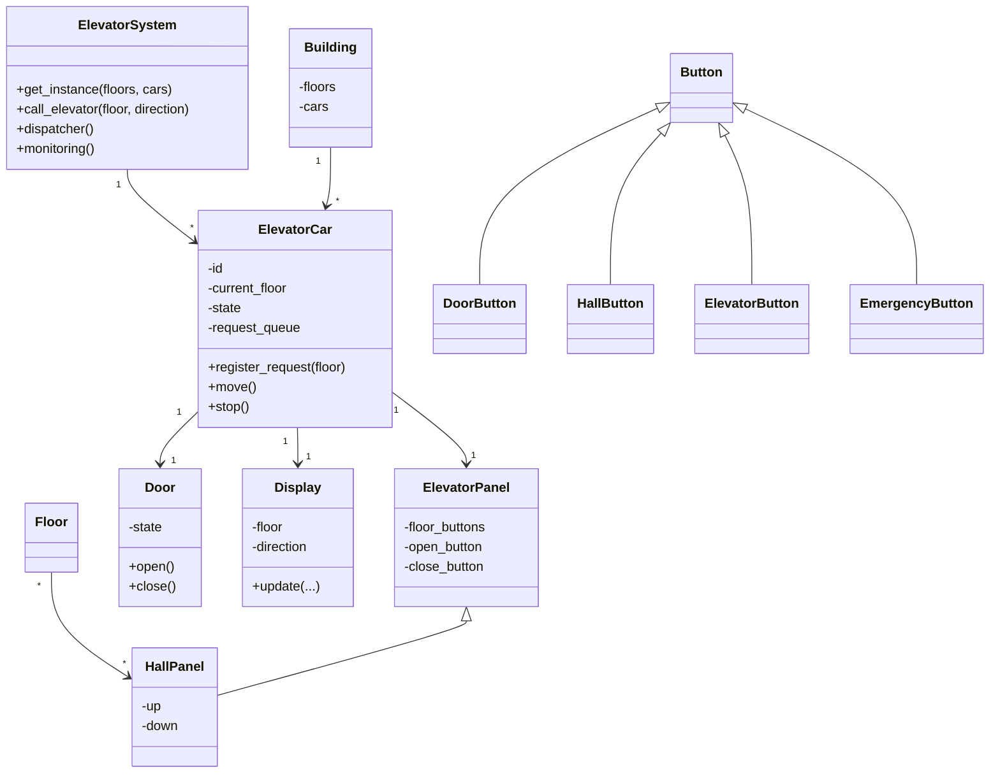
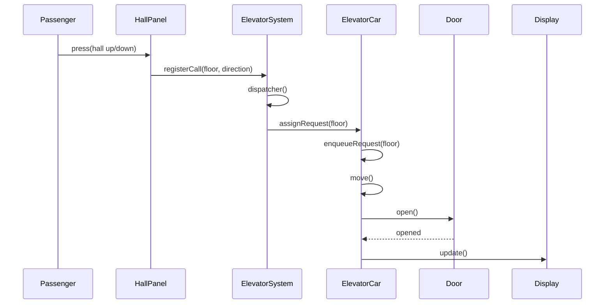
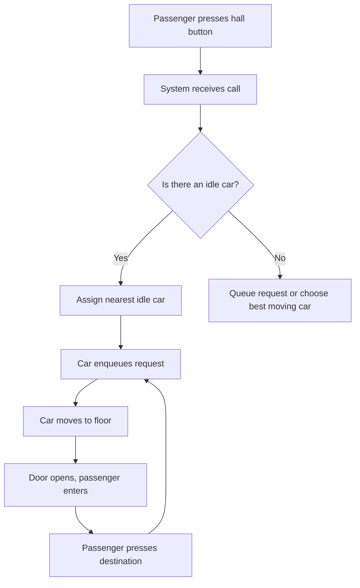

# Elevator System — Low Level Design

This document summarizes the low-level design implemented in this folder. It documents the problem, expectations, assumptions, design approach, mapping to code, design patterns used, requirements, and diagrams (use-case, class, sequence, activity) to make the design easy to review and extend.

## Problem Definition

Design an elevator control system for a building with multiple floors and multiple elevator cars. The system should accept hall calls (up/down) and in-car requests, dispatch elevators to service requests, and handle basic states such as moving, idle, maintenance and door open/close.

Primary goals:

- Correctly route elevator cars to calls.
- Respect elevator states (maintenance, overloaded, emergency).
- Expose a small API to simulate calls and observe system status.

## Expectations (Functional & Non-functional)

Functional

- Call an elevator from any floor with a direction (up/down).
- Select a destination inside an elevator.
- Dispatch nearest appropriate elevator when possible.
- Put an elevator into/out of maintenance mode.
- Show simple elevator displays (current floor, direction, load/state).

Non-functional

- Simplicity and clarity for interview/demo purposes.
- Extensible to support more advanced dispatch strategies.

## Assumptions

- Building floors are numbered 0 .. N-1.
- Hall panels have up/down buttons (no duplicate directions on top/bottom).
- Each elevator car has an internal panel for floor selection and basic controls (open/close/emergency).
- Load / overload logic is tracked but simplified.

## Design Approach

We split responsibilities across small classes that map directly to physical/electrical components:

- ElevatorSystem: top-level controller (singleton) that builds the building, tracks elevator cars and handles calls.
- Building / Floor: container objects for floors and panels.
- ElevatorCar: represents a single car — maintains current floor, request queue, door, display and state flags (maintenance, overloaded).
- ElevatorPanel / HallPanel: in-car and hall-side control panels with buttons.
- Button hierarchy: abstract Button base class and specialized DoorButton, HallButton, ElevatorButton and EmergencyButton.
- Door and Display: small components to reflect the door state and display information.
- Direction / ElevatorState / DoorState: enums capturing closed set of states.

This separation keeps each class focused, making the system easy to test and extend.

### Dispatching (high-level)

1. Passenger presses a hall button on a floor (up/down) → HallPanel registers the request with ElevatorSystem.
2. ElevatorSystem selects an elevator (nearest idle, or one moving in same direction depending on algorithm) and registers the request with the chosen ElevatorCar.
3. ElevatorCar enqueues the request, moves toward the target, stops, opens door, updates display.

The current implementation includes placeholders for dispatcher and monitoring methods to allow plugging different dispatch strategies.

## Design Patterns Used

- Singleton: `ElevatorSystem` exposes a `get_instance(...)` factory and holds a single system instance.
- State (lightweight): states (ElevatorState, DoorState) are modelled as enums; behavior changes depending on state.
- Observer / MVC (conceptual): Panels and Displays act like views; ElevatorCar is the model — the code is structured so displays/panels can be notified when model changes (not fully implemented but the separation exists).

## Requirements

- Python 3.8+
- No external packages required (standard library only).

How to run the demo

```bash
# From this folder
python3 main.py
```

The `main.py` file includes two scenarios showing maintenance mode and random repositioning before sending calls.

## Code mapping (file → responsibility)

- `ElevatorSystem.py` — system-level orchestration, Building and singleton factory.
- `ElevatorCar.py` — elevator car logic, request queue, movement, door/display references.
- `ElevatorPanel.py` — elevator internal panel and hall panels.
- `Button.py` — Button base class and concrete button types.
- `Door.py` — door representation and `Floor` class.
- `Display.py` — display state and update logic.
- `Direction.py` — `Direction`, `ElevatorState`, `DoorState` enums.
- `main.py` — demo scenarios and simple CLI-style outputs.

## Use cases (textual)

1. Call elevator from floor X going UP/DOWN.
2. Select floor Y from inside an elevator.
3. Put an elevator into maintenance and release it.
4. Emergency stop (button) inside elevator.

## Diagrams

Below are mermaid diagrams that visualize key design artifacts. If your renderer supports mermaid these will render; otherwise they serve as plain-text diagrams.

### Use-case (high level)

```mermaid
usecase
  actor Passenger
  Passenger --> (Call elevator)
  Passenger --> (Select floor inside elevator)
  Passenger --> (Press emergency)
  (Call elevator) --> ElevatorSystem
  (Select floor inside elevator) --> ElevatorCar
```

### Class diagram (simplified)



### Sequence: Passenger call -> Dispatcher -> Car



### Activity: Handle a hall call (simplified)



## Sequence of execution / Demo notes

- `main.py` constructs the system via the singleton `ElevatorSystem.get_instance(...)` and runs two scenarios: placing an elevator in maintenance and random repositioning then calling the elevator.

## Extensibility & Improvements

- Implement concrete dispatcher strategies (nearest idle, look-ahead, collective control).
- Implement proper observer notifications so Display and Panels subscribe to ElevatorCar state changes.
- Implement persistence or telemetry for usage statistics.
- Add concurrency/threading to simulate time-based movement and asynchronous calls.

## Open design decisions / TODOs

- `ElevatorSystem.dispatcher()` is a stub — replace with a concrete dispatch algorithm.
- `ElevatorCar.move()` and other action methods are placeholders in the current design — implement motion logic and timing.
- Add input validation and more robust emergency/overload handling.

---

If you want, I can also:

- implement a concrete dispatch algorithm and update the README with comparison notes, or
- add runnable unit tests that assert expected dispatching behaviour for a few scenarios.
